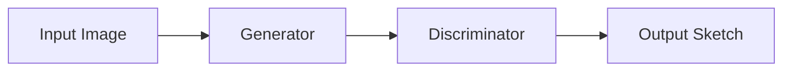

# 🎨 StyleGAN Pencil Sketch Effect
<div align="center">


[](https://www.python.org/)
[](https://pytorch.org/)
[](LICENSE)

*Transform your photos into artistic pencil sketches using StyleGAN!* ✨
</div>

## 📚 Table of Contents
- [Overview](#-overview)
- [Installation](#-installation)
- [Dataset Preparation](#-dataset-preparation)
- [Training](#-training)
- [Usage](#-usage)
- [Results](#-results)
- [Architecture](#-architecture)
- [Troubleshooting](#-troubleshooting)

## 🌟 Overview
This project uses StyleGAN architecture to transform regular photos into pencil sketch artworks. The model is trained on a dataset of pencil sketches and can convert any input image into a similar artistic style.

<details>
<summary>💡 How it Works</summary>

1. **Training Phase**: The GAN learns from real pencil sketches
2. **Conversion Phase**: Uses learned features to transform photos
3. **Optimization**: Fine-tunes output for best results
</details>

## 🚀 Installation
bash
git clone https://github.com/yourusername/StyleGAN_PencilSketch.git
cd StyleGAN_PencilSketch
pip install -r requirements.txt

## 📦 Dataset Preparation
1. **Download Training Images**

```bash
python download_images.py
```
This will create a `downloaded_images` folder with pencil sketch images.

> 💡 **Tip**: For best results, use at least 1000+ training images!

## 🎯 Training
```bash
python train.py
```

<details>
<summary>Training Parameters</summary>

```python
BATCH_SIZE = 8
EPOCHS = 1000
LEARNING_RATE = 1e-4
```
</details>

## 🎨 Usage
1. **Place your input image**:
```
StyleGAN_PencilSketch/
└── data/
    └── input.jpg    # Your photo goes here
```

2. **Apply the effect**:
```bash
python pencil_sketch_effect.py
```

3. **Find your result**:
```
StyleGAN_PencilSketch/
└── data/
    └── stylized_output.jpg
```

## 📸 Results
<div align="center">

| Input | Output |
|-------|--------|
|  |  |

</div>

> 💡 To add your own results, place images in the `assets` folder and update the paths above.

## 🏗️ Architecture


## ⚠️ Troubleshooting
<details>
<summary>Common Issues</summary>

- **Issue**: CUDA out of memory
  - **Solution**: Reduce batch size
- **Issue**: Poor quality output
  - **Solution**: Increase training dataset size
</details>

## 🌈 Contributing
Contributions are welcome! Please feel free to submit a Pull Request.

## 📄 License
This project is licensed under the MIT License - see the [LICENSE](LICENSE) file for details.

---
<div align="center">

Made with ❤️ by [Skaale]


</div>

<!--    
To add images to your README:
1. Create an 'assets' folder in your project
2. Add your images/GIFs there
3. Reference them in the README using relative paths:
   
-->
